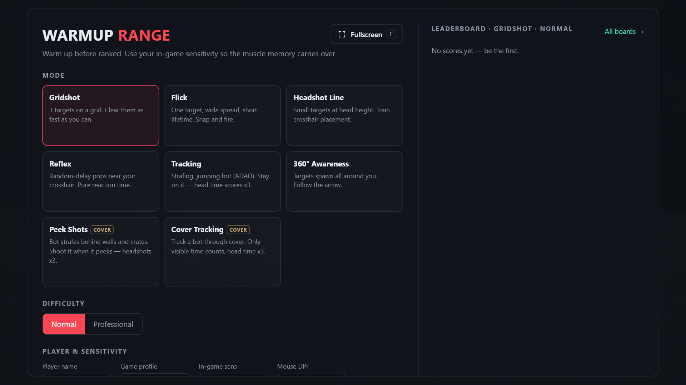
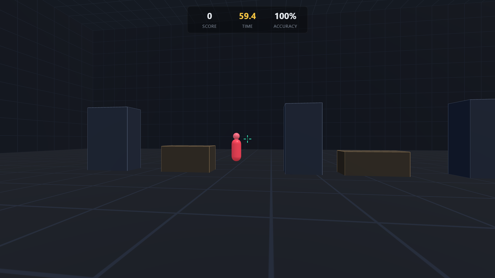
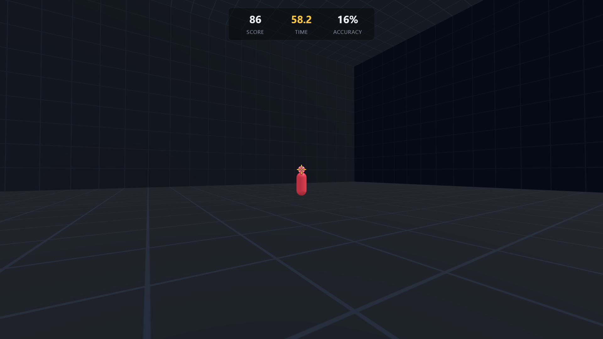
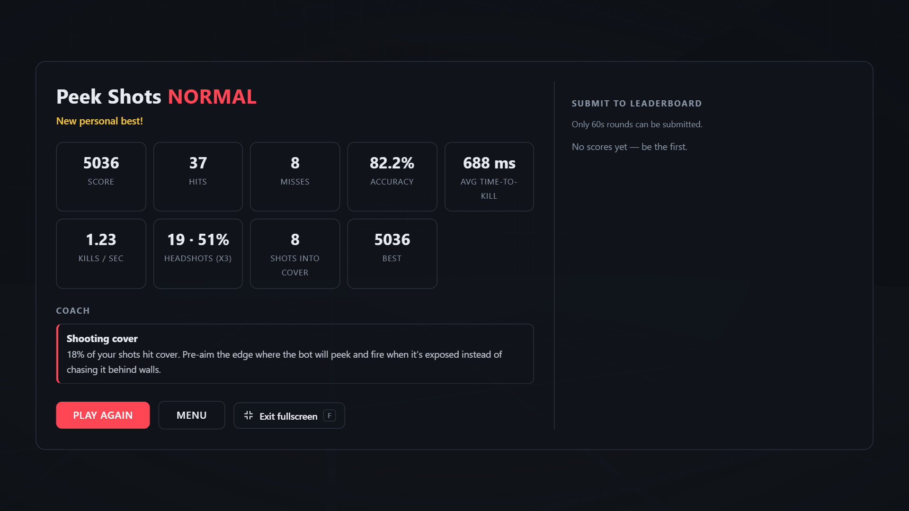

# Warmup Range

**A browser FPS aim trainer for warming up before ranked Valorant or CS2.**
Train with your real in-game sensitivity, shoot bots peeking from behind cover, find your ideal sens, get coached after every round, and climb the online leaderboards.

Built with Next.js (App Router), React and Three.js.

## Demo


*Pick a mode and difficulty, enter your in-game sensitivity and DPI — turn speed and field of view match Valorant or CS2 exactly. The leaderboard for the selected mode sits on the right.*


*Peek Shots: a bot strafes behind walls and half-height crates. Crates hide the body but leave the head exposed; shots into cover count as misses. Headshots score 3x.*


*Tracking: follow a strafing, jumping bot. Time on the body scores, time on the head scores 3x — the crosshair turns gold when you're on the head.*


*After each round: detailed stats, coach tips based on how you played (overshooting, hesitation, shots into cover, headshot rate…) and leaderboard submission.*

## Features

- **8 modes**: Gridshot, Flick, Headshot Line, Reflex, Tracking, 360° Awareness, Peek Shots and Cover Tracking.
- **Normal / Professional** difficulty: smaller targets, shorter lifetimes, faster bots.
- **Headshots x3** on every humanoid bot, in click and tracking modes.
- **Real sensitivity**: Valorant and CS2 profiles with matching yaw and FOV; shows cm/360° and eDPI.
- **Sensitivity Finder**: 5 blind 15-second tests around your sens, then a recommendation with an optional refine pass.
- **Coach**: concrete end-of-round suggestions, e.g. lower your sens by ~10% when you overshoot too many flicks.
- **Online leaderboards** per mode and difficulty (60-second rounds, best score per player name).
- **Fullscreen** button and `F` shortcut, with optional fullscreen on start.

## Controls

| Input | Action |
|---|---|
| Mouse | Aim |
| Left click | Shoot |
| `Esc` | Pause (release the mouse) |
| `F` | Toggle fullscreen |

## Getting started

Requires Node.js 20.9 or later.

```bash
npm install
npm run dev
```

Open http://localhost:3000. Without any environment variables, leaderboard scores are saved to `.data/leaderboard.json`.

Other scripts:

```bash
npm run build      # production build (also type-checks)
npm run start      # serve the production build
npm run typecheck  # TypeScript only
```

## Deploy to Vercel

1. Push this repository to GitHub and import it at [vercel.com/new](https://vercel.com/new). The defaults (framework *Next.js*, `npm run build`) work as is.
2. For persistent leaderboards, add a free Redis database: in the Vercel project open **Storage → Upstash for Redis**, or create one at [upstash.com](https://upstash.com).
3. Make sure the project has these environment variables (the Vercel integration adds the `KV_REST_API_*` pair automatically, which also works):

   | Variable | Value |
   |---|---|
   | `UPSTASH_REDIS_REST_URL` | REST URL of the database |
   | `UPSTASH_REDIS_REST_TOKEN` | REST token of the database |

4. Redeploy. Without these variables the app still works, but leaderboard scores are kept in memory only and reset when the server restarts.

## Project structure

| Path | What |
|---|---|
| `lib/game/config.ts` | Modes, difficulties, game profiles, scoring constants |
| `lib/game/engine.ts` | Three.js scene, input, targets, cover, scoring |
| `lib/game/coach.ts` | End-of-round suggestions |
| `lib/game/sensFinder.ts` | Sensitivity finder plan and analysis |
| `lib/leaderboard/*` | Storage (Upstash Redis or local file) and submission validation |
| `app/api/scores/route.ts` | `GET ?mode=&diff=` top scores, `POST` submit a score |
| `components/Game.tsx` | Menus, HUD, results and finder UI |

## Known limitations

- Scores are computed in the browser, so the server can only reject impossible runs — it cannot fully prevent cheating.
- Player names are not accounts: anyone can submit under any name.
